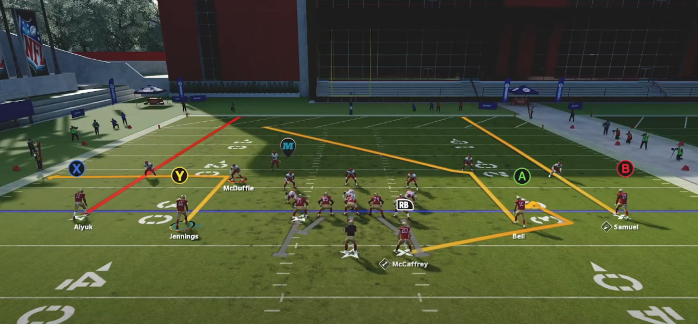
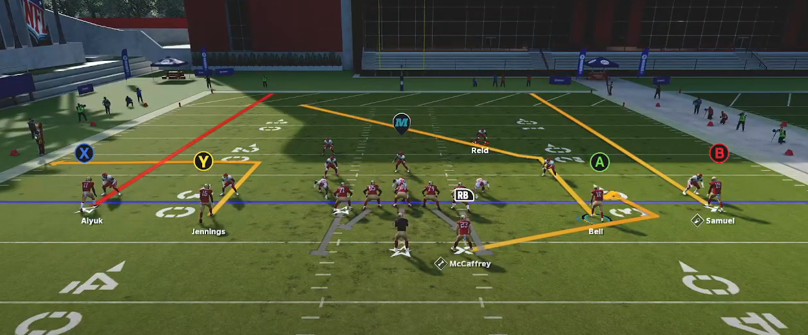
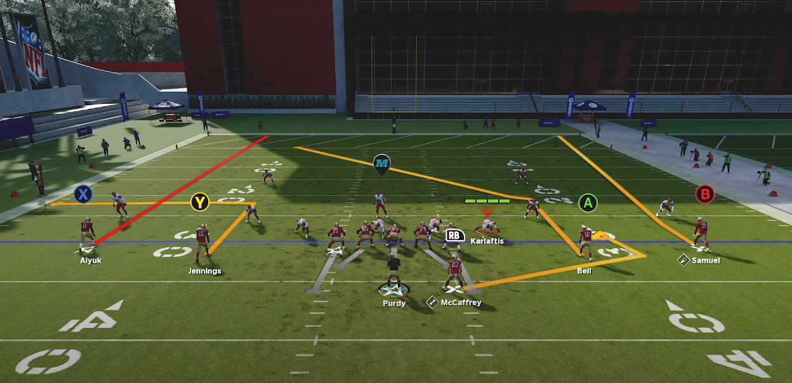
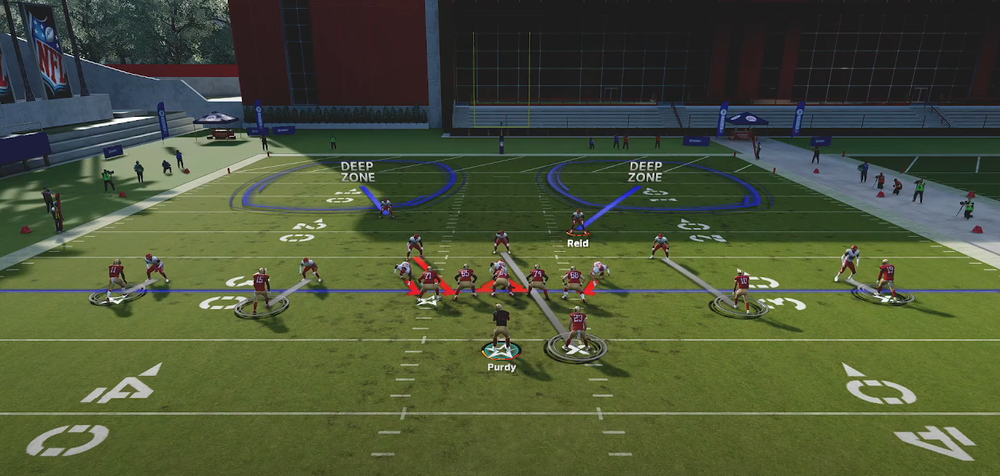
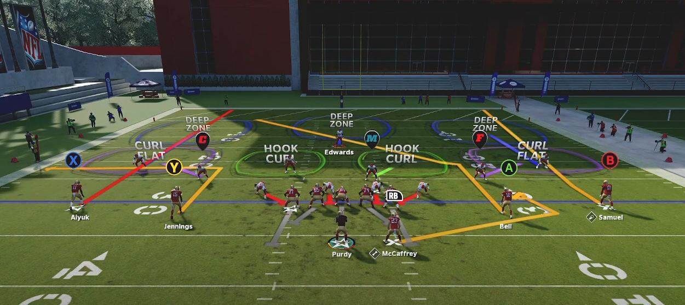
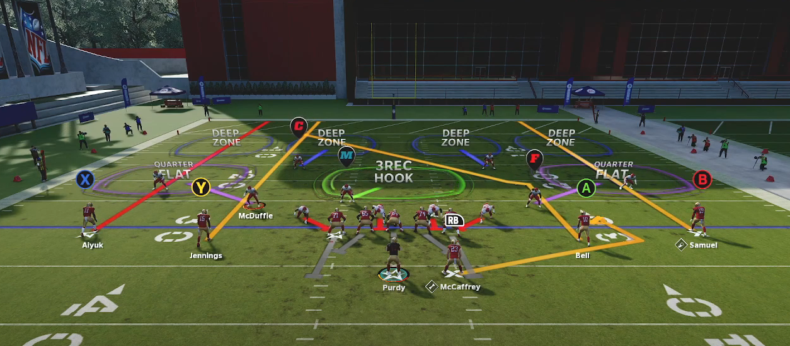
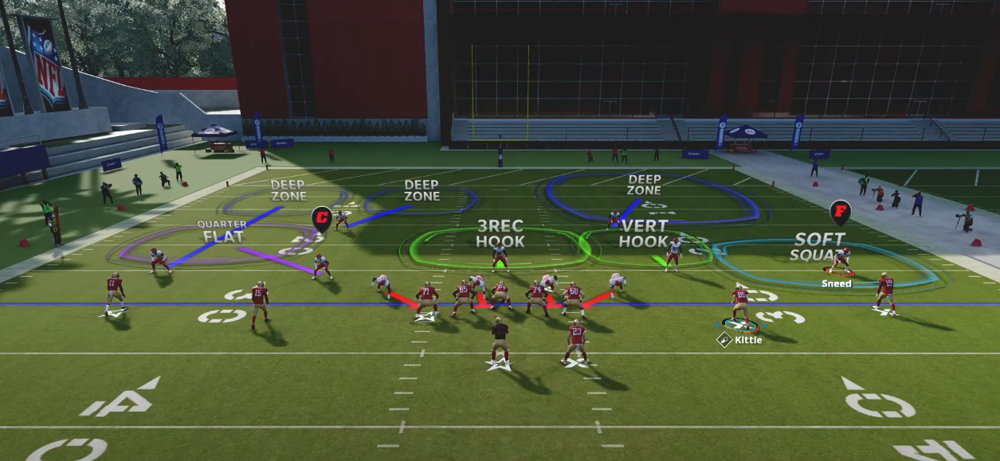

<!-- markdownlint-disable MD007 -->
# Identifying Coverages

## Presnap

### Cover 0

- Pre Snap
    - Safeties
        - 10 yards off the football
        - If man, will be eye to eye with the player they are manned up to
            - Mainly slot receivers and TE's
            - So if a Safety is not eye with someone they either have someone in the backfield or blitzing
    - Corners
        - Inside levarage on receivers
    - All safeties and corners look as if they are one an 'even' level
- Post Snap
    - Players will be either manned up or blitzing

 Please go to [Attacking Coverages: Cover 0](./attacking_coverages/cover0/cover0.md) to leaern how to attack Cover 0.

### Cover 1

- Pre Snap
    - Safeties
        - Single high safety
        - Can come out in two high
            - A big tell with this is if a safety is slightly lower than another
              - More than not, the lower safety will be the 'robber' or 'hook zone'
    - Corners
        - Biggest tell is all corners will be eye to eye with their receiver
            - Only defense in the game where everyone will be eye-to-eye
    - All safeties and corners look as if they are one an 'even' level
- Post Snap
    - 1 Safety highh
    - Either all non-man players are blitzing or a safety/linebacker is playing some type of hook zone towards the middle of the field
    - Although they are eye-to-eye, corners will play their man with outside levarage
            - The idea is to funnel everything to the safety and "robber" player (mike or safety)

 Please go to [Attacking Coverages: Cover 1](./attacking_coverages/cover1/cover1.md) to leaern how to attack Cover 1.

### Cover 2

- Pre Snap
    - Safeties
        - 2-high
    - Corners
        - 5 yards off the ball with outside levarage
            - This only applies to Cover 2 so it's easy to recognize this coverage
    - Don't even need to look at anyone else on the field to recognize cover 2 if you just notice corners
- Post Snap
    - 2 High safeties
    - Sometimes you can have inverts where the corners play the 2-high and safeties come down and play the middle of the field

 Please go to [Attacking Coverages: Cover 2](./attacking_coverages/cover2/cover2.md) to learn how to attack Cover .

### Cover 2 Man

- Pre Snap
    - Safeties
        - 2-High safeties
    - Corners
        - Will align with inside levarage
            - This also applies to slot corners and LBs 
    - Corner alignment is similar to Cover 0
        - The safety alignment lets us know it's Cover 2 man because they are aligned at 15 yards and not 10
- Post Snap
    - 2 High Safeties
    - Will never see an invert of this
    - Cornerbacks will play with inside leverage

 Please go to [Attacking Coverages: Cover 2 Man](./attacking_coverages/cover2_man/cover2_man.md) to leaern how to attack Cover 2 Man.

### Cover 3

- Pre Snap
    - Safeties
        - Single-high safety
    - Corners
        - Outside corners are shaded eye-to-eye
        - Slot corners will be shaded with outside levarage
    - Can tell the difference between this and cover 1
        - Cover 1: slot defender shaded eye-to-eye
        - Cover 3: slot defender has outside levarage
            - Slot defender needs to get out into the flat fast
            - Slot corner also wants to force you inside
    - If they show two high you can typically look at the corners levarage to see if they're bluffing and actually in Cover 3
- Post Snap
    - 3 Deep Zones
    - Will often see the strong safety roll down

 Please go to [Attacking Coverages: Cover 3](./attacking_coverages/cover3/cover3.md) to leaern how to attack Cover .

### Cover4

- Pre Snap
    - Safeties
        - 2-high
    - Corners
        - Outside corners are aligned eye-to-eye and 8 yards off the ball
        - Slot corners/ linebackers will be aligned with inside levarage
            - Cover 4 you only have one hook zone
            - So slot corner has to cover more field
            - Aligning inside allows him to naturally cover tha
    - All safeties and corners look as if they are one an 'even' level
- Post Snap
    - Players will be either manned up or blitzing

 Please go to [Attacking Coverages: Cover 4](./attacking_coverages/cover4/cover4.md) to leaern how to attack Cover .

### Cover 3 Cloud

- Pre Snap
    - A split field coverage: on side looks different than another
    - One side will look exactly like cover 3
    - The other side has a hard cloud/flat with an outside third by the deep safety
    - The flat defender will be pressed in a hard flat or 5 yards off the ball
- Post Snap
    - 3 Deep Zones
    - Will see both safeties stay up
      - Another difference from regular cover 3

Please go to [Attacking Coverages: Cover 3 Cloud](./attacking_coverages/cover3/cover3_cloud.md) to leaern how to attack Cover .

### Cover4 Match

- Pre Snap
    - Same as Cover 4
- Post Snap
    - Players will be either manned up or blitzing

 Please go to [Attacking Coverages: Cover ](./attacking_coverages/cover0/cover.md) to leaern how to attack Cover .

### Cover 6

- Pre Snap
    - One side is cover 4 and the other side is cover 2. **2 + 4 = 6**
    - This is match coverage
        - Only time this won't match is if your opponent has set their zone drops on which negates match in the play
            - Known as a "spot-drop" zone
    - Typically, cover 4 is played to the field (or formation strength) and cover 3 is played to the boundary
- Post Snap
    - Players will be either manned up or blitzing

 Please go to [Attacking Coverages: Cover 6](./attacking_coverages/cover6/cover6.md) to leaern how to attack Cover 6.

## Post Snap

- ashd
  
### Importance of Isolating a Player

- Never Try to read the whole field on a given play
    - To make quick decisions, isolate someone on the field
    - From there, you can put routes on the field to manipulate that player
    - As you go through your reads, you will read the next defender up as needed
- After several plays of isolating one defender, you can get a picture of the whole field
    - Starting your game with a **script** can allow you to figure out the defense in one driver
    - You can learn where defenders tend to be placed and the exploit the tendencies

### Read the Second Level FIRST

- Read the second level players at the snap before evaluating any coverages
- Knowing if a blitz is coming will tell you a few things about the play:
    - How much time you have to get the ball out
    - Potential areas of the field that will be open
    - Reveal the routes you should focus on

### Reading Deep Safety

- Deep safety zones will run to the same spot regardless of which hasmark the offense is on
  - Deep Halves will always run to the numbers
  - Inside thirds will run to the dead center of the field
  - Inside Quarters will always run between the numbers and hashmarks

### Reading Outside CB zones

- Flat defenders will shuffle backwards with their eyes on the QB
- Deep outside zones will run up the field witrh their back turned to the QB
    - Outside Third
    - Outside Quarter

### Reading Zones in the Second Level (Flats vs Hooks)

- If the defender drifts up the field, it is a hook zone
- If the defender runs to the flat, it is a flat zone
    - Curl flat the DB/LB will play a bit slower and bump receivers
    - Hard flats they run straight to the zone

### Determining Man vs Zone

- Press Man will run step for step with the receiver the entire way
- Off Man Coverage will wait for your receiver until he makes a cut or threatens the defender deep
- Spot Drop Zone Coverage means defenders will run to a spot, not a receiver